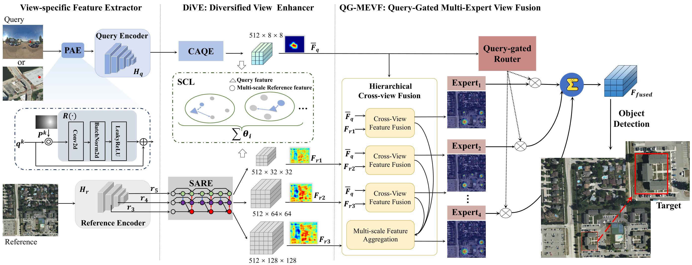

# HiSymGeo

<p align="center">
  <b>Hierarchical Context Symbiosis for Cross-View Object-Level Image Geo-Localization</b>
</p>

<p align="center">
  <b>IEEE Transactions on Image Processing (TIP), 2026</b>
</p>

<p align="center">
  <a href="https://doi.org/10.1109/TIP.2026.3700932">Paper</a>
</p>

**Cuiqun Chen, Qi Chen, Mang Ye, Xingyi Zhang**

[Overview](#overview) · [Installation](#installation) · [Training](#training) · [Evaluation](#evaluation) · [Citation](#citation)

## Overview

This repository provides the official PyTorch implementation of **HiSymGeo**, a hierarchical context symbiosis framework for **cross-view object-level image geo-localization (CVOIGL)**.

CVOIGL aims to localize a user-specified object from a ground/drone-view query image in a large satellite reference image. The task is particularly challenging because of severe cross-view appearance differences, target scale variations, and visually similar structures in satellite imagery.

HiSymGeo addresses these challenges with two cooperative components:

1. **Diversified View Enhancer (DiVE)** learns view-specific query and reference representations. It enhances query context while constructing scale-aware/scale-robust reference representations and uses semantic-aware contrastive learning to improve cross-view alignment.
2. **Query-Gated Multi-Expert View Fusion (QG-MEVF)** builds hierarchical cross-view fusion experts from multi-scale reference features and uses a query-conditioned router to dynamically select the most relevant fusion expert for each query.

<p align="center">
  <a href="assets/framework.pdf"></a>
</p>

## Highlights

- Hierarchical cross-view representation learning for **object-level** geo-localization.
- **DiVE** addresses query-reference view differences and target scale variations using diversified view-specific enhancement.
- **QG-MEVF** introduces query-conditioned dynamic expert routing for adaptive multi-scale cross-view fusion.
- The paper reports state-of-the-art performance on **CVOGL**.
- Selected CVOGL results:
  - Ground-to-Satellite: **50.87 / 47.37** Acc@0.25 / Acc@0.50.
  - Drone-to-Satellite: **68.65 / 63.41** Acc@0.25 / Acc@0.50.
- Demonstrates strong cross-dataset generalization on **VisLoc-Building**, reaching **53.91% Acc@0.50**.

## Repository Structure

```text
HiSymGeo/
├── dataset/
│   ├── data_loader.py            # CVOGL data loading and augmentation
│   └── data_loader_vigor.py      # Additional / cross-dataset data utilities
├── model/
│   ├── HisymGeo.py               # Main HiSymGeo architecture
│   ├── PALA.py                   # Query-side attention enhancement
│   ├── BiFPN.py                  # Multi-scale reference feature pyramid
│   ├── CrossViewMutilScaleFusionv.py
│   ├── DynamicFeatureSelector.py # Query-gated expert routing
│   ├── darknet.py                # Reference encoder
│   └── loss.py
├── scripts/
│   ├── run_train_droneaerial.sh
│   ├── run_train_svi.sh
│   ├── run_test_droneaerial.sh
│   └── run_test_svi.sh
├── train.py
├── train_newdata.py
├── eval_hisymgeo_csv.py
├── measure_efficiency.py
├── requirements.txt
└── utils/
```

The main network is implemented in `model/HisymGeo.py`. Multi-scale cross-view fusion is implemented in `model/CrossViewMutilScaleFusionv.py`, while the query-conditioned hard expert selection is implemented by `DynamicFeatureSelector` / `GateNetwork` in `model/DynamicFeatureSelector.py`.

## Installation

Clone the repository and enter its root directory:

```bash
git clone https://github.com/chenqi142/HiSymGeo.git
cd HiSymGeo
```


Create an isolated environment:

```bash
conda create -n hisymgeo python=3.11 -y
conda activate hisymgeo
```

The released dependency file is an environment snapshot. Review the compatibility notes below and resolve the platform-specific packages before using:

```bash
pip install -r requirements.txt
```

> **Environment note.** The snapshot pins PyTorch `2.11.0+cu128` and TorchVision `0.26.0+cu128` and includes CUDA toolkit packages. Select packages and a PyTorch installation source appropriate for your platform; installing PyTorch first does not override these pins. Check augmentation-library API compatibility as well. This snapshot is not a validated, portable installation recipe.

## Backbone Initialization

The reference encoder loads a YOLOv3 initialization file from:

```text
./saved_models/yolov3.weights
```

Create the output directories and place the YOLOv3 weights there before training or evaluation:

```bash
mkdir -p saved_models logs
# place yolov3.weights in saved_models/
```

The trained HiSymGeo checkpoints reported in the paper are **not included** in the current repository release.

## Dataset Preparation

The released code supports the two CVOGL query settings:

- `CVOGL_DroneAerial`
- `CVOGL_SVI`

The CVOGL dataset is available from the DetGeo project:

- https://github.com/sunyuxi/DetGeo

The expected organization is:

```text
data/
├── CVOGL_DroneAerial/
│   ├── CVOGL_DroneAerial_train.pth
│   ├── CVOGL_DroneAerial_val.pth
│   ├── CVOGL_DroneAerial_test.pth
│   ├── query/
│   └── satellite/
└── CVOGL_SVI/
    ├── CVOGL_SVI_train.pth
    ├── CVOGL_SVI_val.pth
    ├── CVOGL_SVI_test.pth
    ├── query/
    └── satellite/
```

The dataset loader reads each sample as a query image, satellite reference image, click location, target bounding box, and category metadata.

For cross-dataset evaluation, the repository also contains utilities for VIGOR/VisLoc-style data. Please adapt the corresponding paths to your local copy of the dataset.

## Training

**Before running:** prepare the backbone weights and datasets, create `logs/`, and complete the [device/path setup](#important-reproduction-note). The commands below require those adjustments.


### Drone / Aerial Query

The released training script uses:

```bash
bash scripts/run_train_droneaerial.sh
```

The corresponding command is:

```bash
python train.py \
  --emb_size 512 \
  --img_size 1024 \
  --max_epoch 25 \
  --data_root /path/to/data \
  --data_name CVOGL_DroneAerial \
  --beta 1.0 \
  --savename model_droneaerial \
  --batch_size 8 \
  --num_workers 24
```

### Street-View Query

```bash
bash scripts/run_train_svi.sh
```

or:

```bash
python train.py \
  --emb_size 512 \
  --img_size 1024 \
  --max_epoch 25 \
  --data_root /path/to/data \
  --data_name CVOGL_SVI \
  --beta 1.0 \
  --savename model_svi \
  --batch_size 8 \
  --num_workers 24
```

## Evaluation

Validation and testing scripts are provided for both query settings.

Drone / aerial query:

```bash
bash scripts/run_test_droneaerial.sh
```

Street-view query:

```bash
bash scripts/run_test_svi.sh
```

You can also call `train.py` directly with `--val` or `--test` and provide a checkpoint using `--pretrain`.

Example:

```bash
python train.py \
  --test \
  --pretrain /path/to/checkpoint.pth.tar \
  --emb_size 512 \
  --img_size 1024 \
  --data_root /path/to/data \
  --data_name CVOGL_DroneAerial \
  --batch_size 8
```

Additional CSV-based evaluation is available through:

```bash
python eval_hisymgeo_csv.py \
  --csv_path /path/to/test.csv \
  --query_root /path/to/query \
  --sat_root /path/to/satellite \
  --ckpt /path/to/checkpoint.pth.tar \
  --device cuda:0
```

## Important Reproduction Note

The repository preserves the original research code and therefore contains several machine-specific defaults.

Before running, please check:

1. The `--data_root` values in `scripts/*.sh`.
2. GPU/device settings in `train.py` and the shell scripts.
3. `model/HisymGeo.py`, which expects `./saved_models/yolov3.weights`.
4. Checkpoint paths in the testing scripts.

In the current `train.py`, `torch.nn.DataParallel` is configured with the original research GPU IDs. Set both the hard-coded `device_ids=[2, 3]` and `--device` to match your machine before training or evaluation. Passing `--gpu` alone does not update the hard-coded `DataParallel` device list. The shell scripts also use local GPU choices. Evaluation still constructs the model and therefore requires the YOLOv3 initialization file.

## Method Components in the Code

| Paper Component | Main Code Location |
|---|---|
| Query click / positional fusion | `ResidualConvFusion` in `model/HisymGeo.py` |
| Query feature enhancement | `PALA` in `model/PALA.py` |
| Multi-scale reference representation | `BiFPN` + reference encoder in `model/HisymGeo.py` |
| Hierarchical cross-view fusion | `model/CrossViewMutilScaleFusionv.py` |
| Query-gated router | `GateNetwork` in `model/DynamicFeatureSelector.py` |
| Dynamic expert selection | `DynamicFeatureSelector` in `model/DynamicFeatureSelector.py` |
| Detection / localization head | `fcn_out` in `model/HisymGeo.py` |
| Cross-view contrastive objective | `model/loss.py`, `train.py` |

## Citation

If you find this work useful, please cite:

```bibtex
@article{chen2026hisymgeo,
  title   = {HiSymGeo: Hierarchical Context Symbiosis for Cross-View Object-Level Image Geo-Localization},
  author  = {Chen, Cuiqun and Chen, Qi and Ye, Mang and Zhang, Xingyi},
  journal = {IEEE Transactions on Image Processing},
  volume  = {35},
  pages   = {6401--6415},
  year    = {2026},
  doi     = {10.1109/TIP.2026.3700932}
}
```

## Acknowledgements

We thank the authors of CVOGL/DetGeo and the related open-source cross-view geo-localization projects for making their datasets and code available to the community.

## License

No project-level `LICENSE` file is included in the current release. Please contact the authors to clarify code reuse permissions. Datasets and third-party components retain their own licenses.
